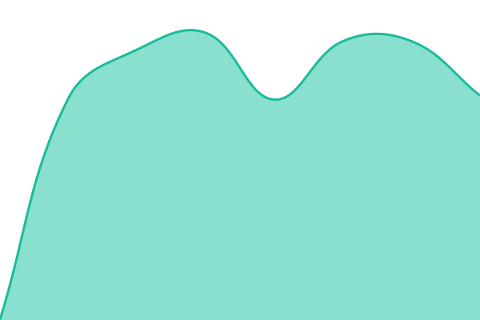
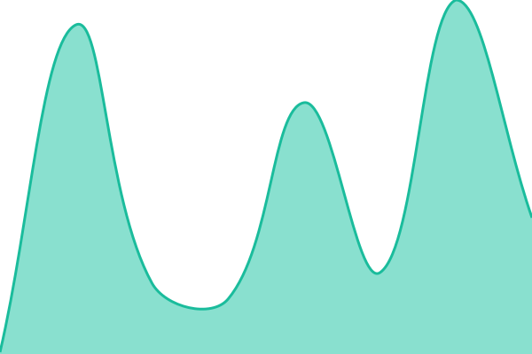
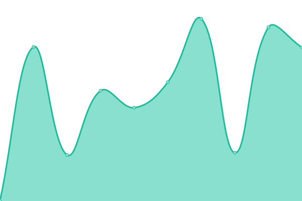

# [📈 Live Status](https://Abdulhadi446.github.io/upptime): <!--live status--> **🟩 All systems operational**

This repository contains the open-source uptime monitor and status page for [AbdulHadi](https://sodeom.com/), powered by [Upptime](https://github.com/upptime/upptime).

With [Upptime](https://upptime.js.org), you can get your own unlimited and free uptime monitor and status page, powered entirely by a GitHub repository. We use [Issues](https://github.com/Abdulhadi446/upptime/issues) as incident reports, [Actions](https://github.com/Abdulhadi446/upptime/actions) as uptime monitors, and [Pages](https://Abdulhadi446.github.io/upptime) for the status page.

<!--start: status pages-->
<!-- This summary is generated by Upptime (https://github.com/upptime/upptime) -->
<!-- Do not edit this manually, your changes will be overwritten -->
<!-- prettier-ignore -->
| URL | Status | History | Response Time | Uptime |
| --- | ------ | ------- | ------------- | ------ |
|  [Main Site](https://thetrillioniar.me/) | 🟩 Up | [main-site.yml](https://github.com/Abdulhadi446/upptime/commits/HEAD/history/main-site.yml) | 

 665ms
     
 | 

<a href="https://Abdulhadi446.github.io/upptime/history/main-site">100.00%</a>
    

|  [WWW Redirect](https://www.thetrillioniar.me/) | 🟩 Up | [www-redirect.yml](https://github.com/Abdulhadi446/upptime/commits/HEAD/history/www-redirect.yml) | 

 1202ms
     
 | 

<a href="https://Abdulhadi446.github.io/upptime/history/www-redirect">100.00%</a>
    

|  [Chat Interface](https://chat.thetrillioniar.me/) | 🟩 Up | [chat-interface.yml](https://github.com/Abdulhadi446/upptime/commits/HEAD/history/chat-interface.yml) | 

 671ms
     
 | 

<a href="https://Abdulhadi446.github.io/upptime/history/chat-interface">100.00%</a>
    

|  [Blog](https://blog.thetrillioniar.me/) | 🟩 Up | [blog.yml](https://github.com/Abdulhadi446/upptime/commits/HEAD/history/blog.yml) | 

 650ms
     
 | 

<a href="https://Abdulhadi446.github.io/upptime/history/blog">100.00%</a>
    

|  [Community Hub](https://social.thetrillioniar.me/) | 🟩 Up | [community-hub.yml](https://github.com/Abdulhadi446/upptime/commits/HEAD/history/community-hub.yml) | 

 662ms
     
 | 

<a href="https://Abdulhadi446.github.io/upptime/history/community-hub">100.00%</a>
    

|  [API Docs](https://docs.thetrillioniar.me/) | 🟩 Up | [api-docs.yml](https://github.com/Abdulhadi446/upptime/commits/HEAD/history/api-docs.yml) | 

 627ms
     
 | 

<a href="https://Abdulhadi446.github.io/upptime/history/api-docs">100.00%</a>
    

|  [Status Page](https://status.thetrillioniar.me/) | 🟩 Up | [status-page.yml](https://github.com/Abdulhadi446/upptime/commits/HEAD/history/status-page.yml) | 

 874ms
     
 | 

<a href="https://Abdulhadi446.github.io/upptime/history/status-page">100.00%</a>
    

|  [CDN Assets](https://cdn.thetrillioniar.me/favicon.svg) | 🟩 Up | [cdn-assets.yml](https://github.com/Abdulhadi446/upptime/commits/HEAD/history/cdn-assets.yml) | 

 183ms
     
 | 

<a href="https://Abdulhadi446.github.io/upptime/history/cdn-assets">100.00%</a>
    

|  [Sodeom](https://sodeom.com/) | 🟩 Up | [sodeom.yml](https://github.com/Abdulhadi446/upptime/commits/HEAD/history/sodeom.yml) | 

 247ms
     
 | 

<a href="https://Abdulhadi446.github.io/upptime/history/sodeom">100.00%</a>
    

<!--end: status pages-->

[**Visit our status website →**](https://Abdulhadi446.github.io/upptime)

## 📄 License

- Powered by: [Upptime](https://github.com/upptime/upptime)
- Code: [MIT](./LICENSE) © [Anand Chowdhary](https://anandchowdhary.com)
- Data in the `./history` directory: [Open Database License](https://opendatacommons.org/licenses/odbl/1-0/)
